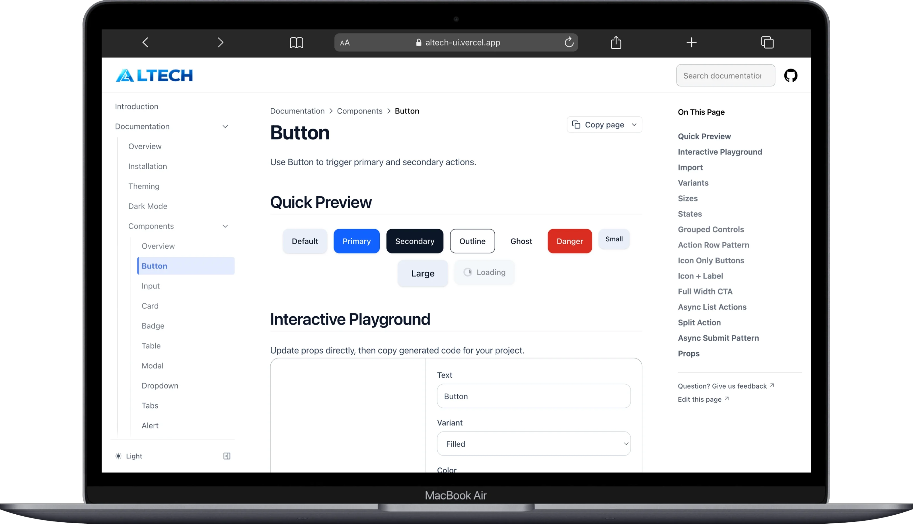
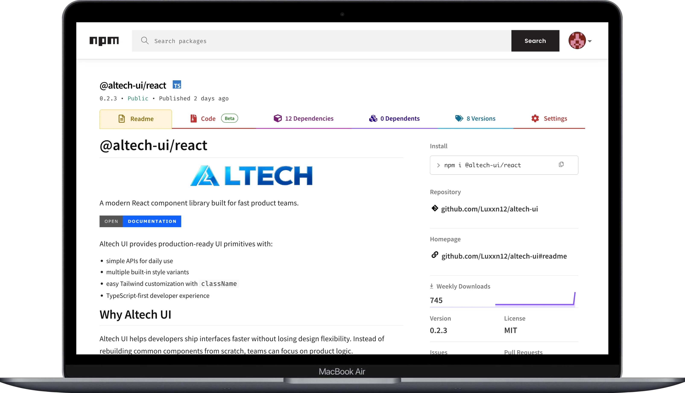

# Altech UI

Altech UI is a monorepo for a React + TypeScript component library with a modern documentation site.

## Preview

## Why Developers Choose Altech UI

Altech UI is built for teams that want to ship UI faster without losing styling control.
Instead of rebuilding common UI patterns from scratch, developers can focus on product logic.

Core value:

- less boilerplate for common components (button, input, modal, table, and more)
- simple component APIs that stay flexible for real-world use cases
- Tailwind-friendly by design via `className` overrides
- typed, accessible, and consistent defaults across components

## Key Advantages

- Productivity-first:
  - ready-to-use components, variants, and common states
- Flexible styling:
  - override with Tailwind utility classes whenever needed
- TypeScript-first:
  - stronger autocomplete and safer UI development
- Consistent design primitives:
  - centralized color/radius/border tokens
- Better UX by default:
  - micro-interactions + `prefers-reduced-motion` support
- Easy adoption:
  - can be adopted incrementally, no big-bang migration required

## Best For

- startup and product teams moving fast
- freelancers or agencies that need high reusability across projects
- internal teams that want UI standardization without limiting creativity

## Packages

- `@altech-ui/react`: reusable UI components (typed, accessible, animated).
- `@altech-ui/docs`: documentation website built with Next.js.

## Tech Stack

- pnpm workspace
- Turborepo
- React 19
- TypeScript
- Tailwind CSS v4
- Next.js (docs app)
- tsup (library build)
- ESLint + Prettier
- Framer Motion
- Radix UI (Dialog primitive)
- class-variance-authority + clsx + tailwind-merge
